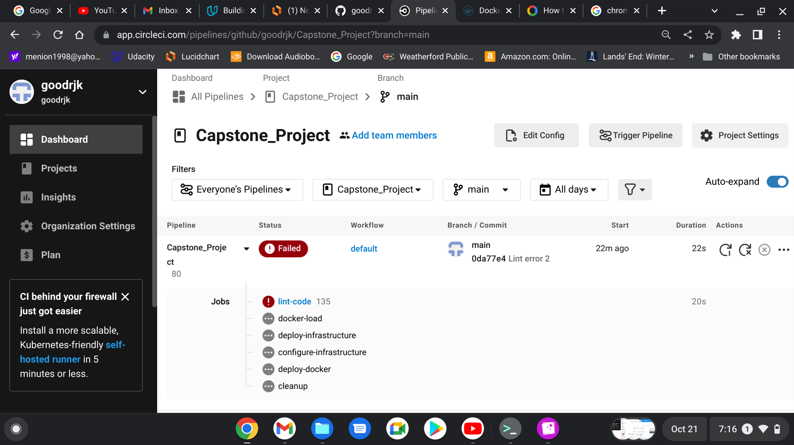
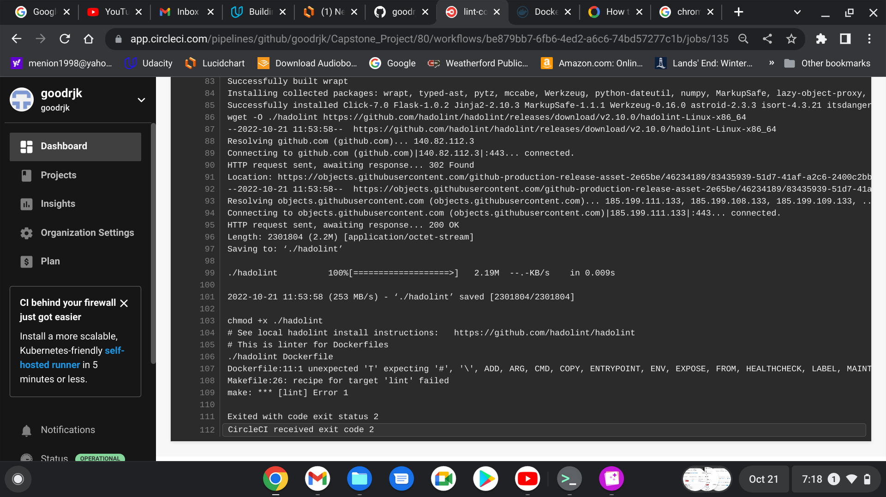

# Capstone_Project
## Capstone Project for Udacity Cloud Devops Engineer

### CircleCI Badge for goodrjk/Capstone_Project   

### Project Summary

Using a pre-trained, `sklearn` model that has been trained to predict housing prices in Boston according to several factors, build a Docker image to allow for starting the app and obtaining house price predictions running both locally and in a Kubernetes cluster.
This requires building and testing the environment, defining and building the Docker image, uploading the new image to Docker, configuring Kubernetes and deploying the container to the cluster. 

## Links

Github		https://github.com/goodrjk/Capstone_Project

CircleCI	https://app.circleci.com/pipelines/github/goodrjk/Capstone_Project?branch=main

DockerHub	https://hub.docker.com/repository/docker/goodrjk/udacity_5
	
### Required files for submission:

## CircleCI Pipeline Jobs

### lint-code
	Check Dockerfile with hadolint  
	Check app.py with pylint
### docker-load
	Build the docker image for app.py
	Push the newly created docker image to DockerHub
### deploy-infrastructure
	Create the EC2 for the Kubernetes cluster using cloudformation
	Name the stack using the contents of the name.txt file concatenating it with Capstone-.
	If name.txt contains BLUE, stack name will be Capstone-BLUE
	Save the IP address of EC2 server
### configure-infrastructure
	Using Ansible load kubectl, minikube and docker
	Using Ansible start minikube
### deploy-docker
	Using Ansible deploy created docker image from DockerHub to Kubernetes cluster
### cleanup
	Delete all old Capstone AWS stacks

|  File                 |    Purpose                                                                   |
| ------------------    | --------------------------------------------------------------------------   |
| README.me             | This file                                                                    |
| Dockerfile            | Configuration file to build and test Docker image                            |
| Makefile              | Configuration file to install and lint                                       | 
| app.py                | Boston Real Estate Prediction Application                                    |
| make_prediction.sh    | Bash shell script to call app with test data                                 |
| run_docker.sh         | Script to build docker container and launch app                              |
| upload_docker.sh      | Script to upload Docker image to goodrjk/udacity_4:firstimage                |
| run_kubernetes.sh     | Script to run                                                                |
| docker_out.txt        | Output from application window and prediction window running local docker    |
| kubernetes_out.txt    | Output from application window and prediction window running with Kubernetes |
| .circleci/config.yml  | Configuration file for CircleCI to test repo                                 |

### Script Execution

Build environment

	make install

Test code

	make lint

Create docker container and launch app

	./run_docker.sh

Make Prediction with local Docker container

	./make_prediction.sh

Upload Docker image to DockerHub

	./upload_docker.sh

Start minikube

	minikube start

Deploy container and launch app

	./run_kubernetes.sh

Make Prediction with Kubernetes

	./make_prediction.sh

