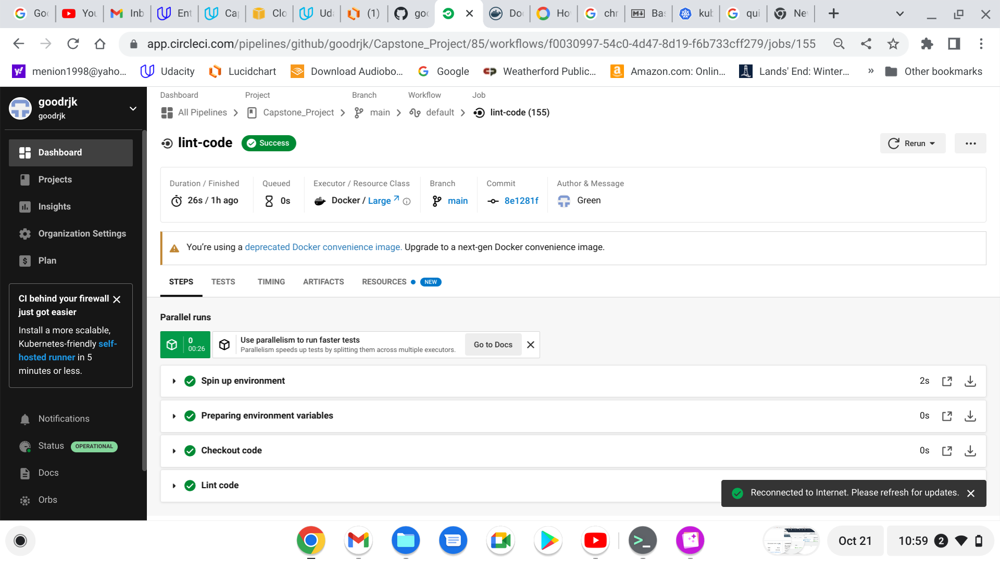
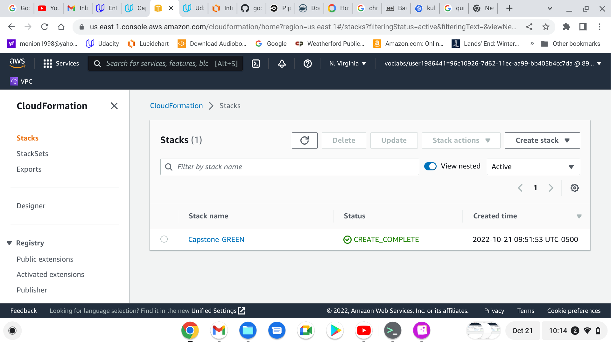

# Capstone_Project
## Capstone Project for Udacity Cloud Devops Engineer

### CircleCI Badge for goodrjk/Capstone_Project   

## Links

Github		https://github.com/goodrjk/Capstone_Project

CircleCI	https://app.circleci.com/pipelines/github/goodrjk/Capstone_Project?branch=main

DockerHub	https://hub.docker.com/repository/docker/goodrjk/udacity_5
	
### Project Summary

The focus of the project to automate building a Docker image, standing AWS infrasture and Kubernetes cluster and deploying the Docker container to the cluster. 
The application used was the Boston real estate predictor from the fourth project of the course.
The repo was stored in GitHub. CircleCI was used to build the continuous integration pipeline. AWS was used to provide the infrastructure.

## Description of the CircleCI Pipeline Jobs

### lint-code
	Check Dockerfile with hadolint  
	Check app.py with pylint
### docker-load
	Build the docker image for app.py
	Push the newly created docker image to DockerHub
### deploy-infrastructure
	Create the EC2 for the Kubernetes cluster using cloudformation
	Name the stack using the contents of the name.txt file concatenating it with Capstone-.
	If name.txt contains BLUE, stack name will be Capstone-BLUE
	Save the IP address of EC2 server
### configure-infrastructure
	Using Ansible load kubectl, minikube and docker
	Using Ansible start minikube
### deploy-docker
	Using Ansible deploy created docker image from DockerHub to Kubernetes cluster
### cleanup
	Delete all old Capstone AWS stacks

## Sets Up Pipeline

### Create Github repository with project code

Code is stored in Github repo at:

	https://github.com/goodrjk/Capstone_Project

Continuous Integration Pipeline is Set Up in CircleCI at:

	https://app.circleci.com/pipelines/github/goodrjk/Capstone_Project?branch=main
	
### Use image repository to store Docker images

Images are stored in DockerHub at:

	https://hub.docker.com/repository/docker/goodrjk/udacity_5

## Build Docker Container

Execute linting step in code pipeline 

	Screenshots of failed lint step

	Screenshot of successful failed lint step

Build a Docker container in a pipeline 

	Screenshot of successful pipeline building and deploying Docker image

	Screenshots of Blue stack and EC2 in AWS Console

	Screenshot of docker image in DockerHub

## Successful Deployment

The Docker container is deployed to a Kubernetes cluster 

	Screenshots showing status of Kubernetes cluster and docker image deployment

Use Blue/Green Deployment or a Rolling Deployment successfully

	Screenshots showing both Blue and Green stacks and EC2 during transition

	Screenshot showing Green pipeline success
 

	Screenshots of Green stack and EC2 in AWS Console

